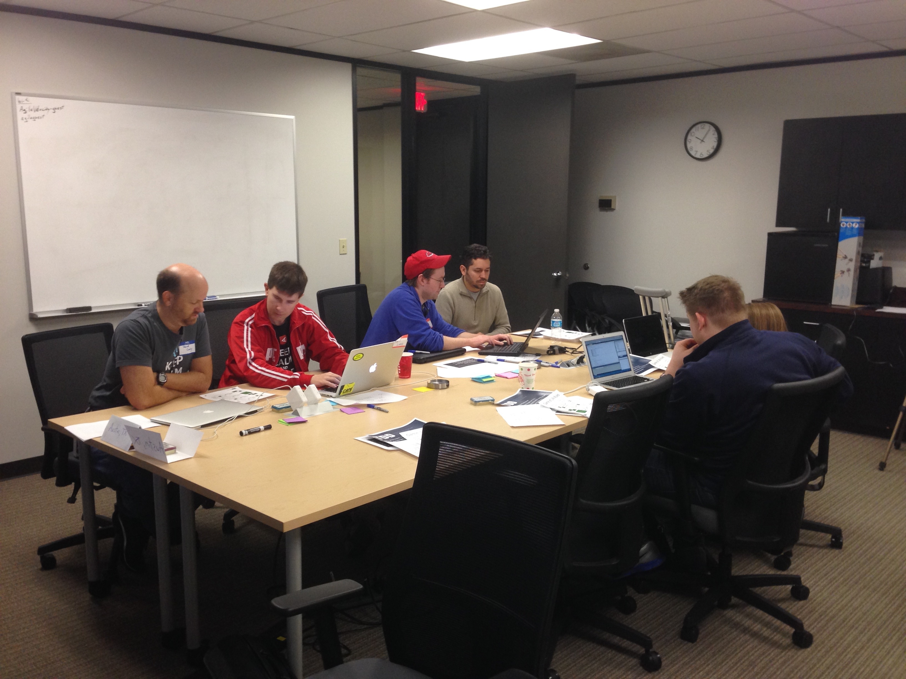

autoscale: true

# [fit] Coderetreat


---

 

---

## [fit] Welcome!

---


---

### Facilitators

* **Eric Stewart** 
    twitter: @ericstewart

* **David Croley** 
    twitter: @davidcroley

---

## Schedule

1. About Coderetreat
2. Design
3. Conway's Game of Life
4. Start Sessions

---


## [fit] What Is Coderetreat?

---


---

### History of Coderetreat

The idea was spawned at CodeMash Conference '09 and first held on January 25, 2009

Originated by:

* Gary Bernhardt
* Patrick Welsh
* Nyan Hajratwala
* Corey Haines

---

### Global Day of Coderetreat

This year, we have 141 participating cities, with 2,500 expected software developers!

This year's Global Day of Coderetreat is supporting CoderDojo: a worldwide, volunteer-driven movement of programming clubs for young people. Any funds not used to support GDCR will go to CoderDojo.

---

### GDCR Supports CoderDojo
#### The global network of free computer programming clubs for young people.

CoderDojo is a global movement of free, volunteer-led,  community based programming clubs for young people.

http://www.coderdojo.com


---


---

### Sponsors

* Thank the sponsors at all levels
* Make sure you get discounts sheet!

---

### Goals

* Perfect Practice and Mastery
* Learn through Pairing
* Extend your Comfort Zone
* Experiment
* Learn new practices
* Think deeply about design
* Have fun!

---


^ Concept of "Cost of Change"

---



### Format

* 8-8:45am: arrive, coffee/breakfast
* 8:45-9am: Welcome, Introductions, Explain the Problem
* 9-Noon: Sessions 1-3 
* Noon-1: Lunch, Socializing
* 1-4pm: Sessions 4-6
* 4-4:30pm: Closing circle

---


### Sessions

* 45 minutes of coding
* Fresh project
* Work in pairs (decide on language)
* Apply constraints
* Don't try to finish!!!
* 15 minutes retrospective/break
* Delete your code

---


## Pair Programming

---


## Pair Programming

* Two people per computer
* Decide on language
* Work together
* **Who** does **what**?

---


^ Have fun with it too!

---

### [fit] Pair Programming - If Hollywood Made a Movie


---

## Test-Driven Development (TDD)

---

### TDD Lifecycle

1. Add a test
2. Run all tests and see if the new one fails
3. Write some code
4. Run tests
5. Refactor code
6. Repeat

---


---

### Participant Introductions

* Get a name tag
* Put your name and preferred languages on the whiteboard

---

## [fit] Simple Design

---

> Perfection is achieved, not when there is nothing more to add, but when there is nothing left to take away.
—Antoine de Saint-Exupéry

---

> Any intelligent fool can make things bigger, more complex and more violent. It takes a touch of genius and a lot of courage to move in the opposite direction.
—Albert Einstein.

---

> Don't write code that guesses the future. Arrange code so that you can adapt to the future when it arrives.
-- Sandi Metz

---

### Simple Design

##### Simple Design is one that is easy to change.

We don't know exactly what is going to need to change. We'll never be more ignorant than we are at this moment.

---

### The Four Rules Simple Design (Kent Beck)

1. Passes All Its Tests
2. Clearly Expresses Intent
3. Contains No Duplication
4. Small (Has No Superflous Parts)

---

### 1. Passes All Tests

Good design/factoring/etc. is useless if code doesn't do what is intended

---

### 2. Clearly Expresses Intent

Pay attention to naming, readability, and how code expresses itself

---

### 3. No Duplication

Essentially the DRY (Don't Repeat Yourself) principle of removing knowledge duplication.

---

### Don't Repeat Yourself (DRY)

This rule isn't about code duplication; it is about knowledge duplication:

> *Every piece of knowledge should have one and only one representation.*
-- The Pragmatic Programmer[^pragprog]

[^pragprog]: http://pragprog.com/book/tpp/the-pragmatic-programmer

---

### 4. Small 

No unused code, check for missing or duplicate abstractions, look for over-abstraction.

---


---

##### J.B. Rainsberger's Simple Design Dynamo
##### http://blog.thecodewhisperer.com/2013/12/07/putting-an-age-old-battle-to-rest/


---


## SOLID Principles

* **S**ingle Responsibility Principle
   A module should have one, and only one, reason to change.
* **O**pen-Closed Principle
  You should be able to extend a classes behavior without modifying it
* **L**iskov Substitution Principle
  Derived objects must be substitutable for the base classes
* **I**nterface Segregation Principle
  Make fine-grained interfaces that are client specific
* Dependency inversion principle
  Depend on abstractions, not on concretions. Dependency injection is an eample.

---

### Law of Demeter
##### (Principle of Least Knowledge)

> A method can access either locally-instantiated variables, parameters passed in, or instance variables.

Or more simple....

> One dot per statement.

---

### Law of Demeter Example[^2]

```ruby
class Wallet
  attr_accessor :cash
end
class Customer
  has_one :wallet
end
class Paperboy
  def collect_money(customer, due_amount)
    if customer.wallet.cash < due_ammount
      raise InsufficientFundsError
    else
      customer.wallet.cash -= due_amount
      @collected_amount += due_amount
    end
  end
end
```


---

### Law of Demeter (Improved)[^2]

```ruby
class Wallet
  attr_accessor :cash
  def withdraw(amount)
     raise InsufficientFundsError if amount > cash
     cash -= amount
     amount
  end
end
class Customer
  has_one :wallet
  # behavior delegation
  def pay(amount)
    @wallet.withdraw(amount)
  end
end
class Paperboy
  def collect_money(customer, due_amount)
    @collected_amount += customer.pay(due_amount)
  end
end
```

[^2]: http://www.dan-manges.com/blog/37

---

### Tell, Don't Ask[^tda]

It is okay to use accessors to get the state of an object, as long as you don't use the result to make decisions outside the object.

Any decisions based entirely upon the state of one object should be made 'inside' the object itself.

---

### Tell, Don't Ask Example[^tda]

```C#
price = item.Price
if (price < 20) {
    item.SetAsBargain()
}
```

```C#
 price = item.Price
  this.LineColor? = price < 20 ? "Green" : "Red"
```

[^tda]: http://c2.com/cgi/wiki?TellDontAsk

---

## [fit] Conway's Game of Life

---


---

### 

---


---


### Patterns

---


### Tetromino Patterns

---

### Still Lifes


Some patterns do not change from one generation to the next

---

### Oscillators


---


## Resources

---

### Starting Points

* [Github: coreyhaines/coderetreat](https://github.com/coreyhaines/coderetreat)
* [Github: Agilefreaks/coderetreat](https://github.com/Agilefreaks/coderetreat) - C#, JavaScript, Ruby, Swift
* [Github: justinwyer/coderetreat](https://github.com/justinwyer/coderetreat-java) - Java
* 

---

### Web

* [LifeWiki](http://www.conwaylife.com/w/index.php?title=Main_Page)

---

### Software

* [Golly](http://golly.sourceforge.net)


---

### Videos

---


---


^ Game of Life in Minecraft 

---


^ Conway's Game of Life Explanation

---


^ Conway's GOL Explanation - Hawking

---
